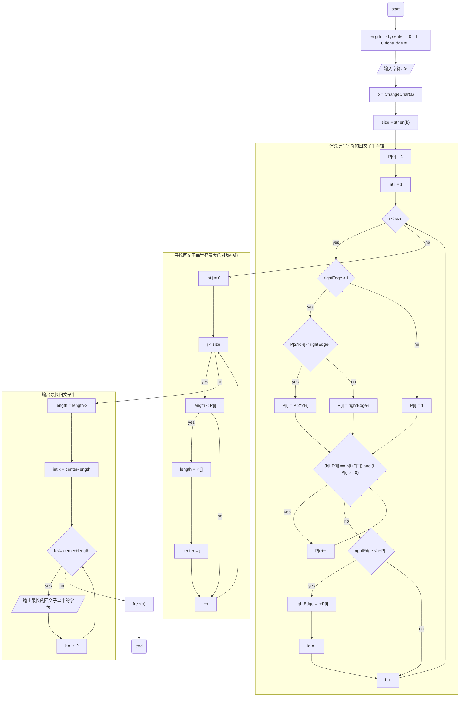

# Lab02

> ## 题目描述
> 
> “回文”是指正读反读都能读通的句子，它是古今中外都有的一种修辞方式和文字游戏，如“我为人人，人人为我”等。回文串指的是正的读和反的读是一样的字符串，例如 "aba"，"ccbbcc"。
> 
> 从键盘读入一个字符串，寻找并输出最⻓的回文子串。探索时间复杂度为线性的方法来寻找回文字符串。

## 源代码

```c
#include <stdio.h>
#include <stdlib.h>
#include <string.h>

// 函数：ChangeChar
// 功能：将字符串进行预处理
// 参数：a - 输入字符串
// 返回：预处理后的字符串
char *ChangeChar(char *a){
    int size = strlen(a);
    char *b = (char*)malloc((2*size+1) * sizeof(char)); // 为预处理后的字符串分配内存

    b[0] = '#'; // 在新字符串的首位添加 #
    for(int i = 0; i < size; i++){
        b[2*i+1] = a[i]; // 将原字符串字符拷贝到新字符串中
        b[2*i+2] = '#'; // 在相邻字符间添加 #
    }
    b[2*size+1] = '\0'; // 添加字符串结束符

    return b; // 返回预处理后的字符串
}

// 函数：Manacher
// 功能：执行Manacher算法找出最长回文子串
// 参数：a - 输入字符串, P - 用于存储每个字符为中心的最长回文子串半径的数组
void Manacher(char *a, int *P){
    char *b;  // 预处理后字符串
    int length = -1; // 最长回文子串半径
    int center = 0; // 最长回文子串的对称中心
    int size; // 预处理后字符串的长度
    int id = 0; // 当前对称中心
    int rightEdge = 1; // 当前对称中心下最长回文子串的右边界

    b = ChangeChar(a); // 字符串预处理 
    size = strlen(b);
    P[0] = 1; // 以脚标为0的字符为中心的最长回文子串的半径

    for(int i = 1; i < size; i++){
        if(rightEdge > i){
            P[i] = P[2*id-i] < rightEdge-i? P[2*id-i]:rightEdge-i; // 根据对称性来确定P[i]的初值
        }
        else{
            P[i] = 1;
        }

        for(;b[i-P[i]] == b[i+P[i]] && (i-P[i] >= 0); P[i]++); // 以i为中心扩展

        if(rightEdge < i+P[i]){
            rightEdge = i+P[i];
            id = i; // 更新当前对称中心位置
        }
    }

    for(int j = 0; j < size; j++){
        if(length < P[j]){
            length = P[j];
            center = j;
        }
    }

    length = length - 2;
    for(int k = center - length; k <= center + length; k = k + 2){
        printf("%c", b[k]); // 打印最长回文子串
    }
    free(b); // 释放内存
    printf("\n");
} 

int main(){
    char a[256]; // 输入的字符串长度不能大于255，否则strlen()函数会出错
    int P[256]; 

    scanf("%s", a); // 读取输入字符串
    Manacher(a, P); // 调用Manacher算法

    return 0;
}
```

## 算法流程图



## 核心代码解释

在进行Manacher算法时，字符串需要进行预处理。预处理方式是在字符串前后和所有字母间插入 `#` ，以确保长度为奇数的字符串和长度为偶数的字符串最终长度都为基数，便于寻找回文子串的对称中心。

字符串 `a` 是原始字符串，字符串 `b` 是预处理后的字符串，列表 `P` 内存放的是“以当前字母或符号为对称中心生成的最长的回文子串的长度（不包括符号）$+1$“。

```c
    for(int i = 1; i < size; i++){
        if(rightEdge > i){
            P[i] = P[2*id-i] < rightEdge-i? P[2*id-i]:rightEdge-i; // 根据对称性来确定P[i]的初值
        }
        else{
            P[i] = 1;
        }

        for(;b[i-P[i]] == b[i+P[i]] && (i-P[i] >= 0); P[i]++); // 以i为中心扩展

        if(rightEdge < i+P[i]){
            rightEdge = i+P[i];
            id = i; // 更新当前对称中心位置
        }
    }
```

这一部分循环遍历包含了2个判断结构和1个循环结构：

- 第1个判断结构的目的是更新 `P` 的值，判断条件是当前对称中心的最长回文子串右边界是否**大于**当前正在遍历的对象。
  
  - 如果结果为真，代表此遍历对象被包含在当前中心的最长回文子串中。
    
    - 此时我们考虑 `P[2*id-i] < rightEdge-i` ，这意味着对称中心左侧对应的字母的回文子串对称到右侧去后依然被包含在当前中心的最长回文子串中，这说明左右侧的情况是完全相同的，于是我们复制 `P[2*id-i]` 的值。
    
    - 
    
    - 考虑 `P[2*id-i] >= rightEdge-i`，如果我们此时依旧取`P[2*id-i]` ，事实上当前中心的最长回文子串的长度（`P[id]`）就应该更长，推导出矛盾，所以我们此时最多只能使当前对象的最长回文子串右边界与当前中心的最长回文子串重合，取 `rightEdge-i` 。
    
    - 
    
    - 因此，我们使 `P[i]` 的值取 `P[2*id-i]` 和 `rightEdge-i` 中更小的那个。
  
  - 如果结果为假，代表此遍历对象在当前中心的最长回文子串右边界处或更右侧，此时我们无法基于已知条件来判断 `P[i]` 的值，所以将它初始化为$1$。
  
  - 

- 循环结构实则是以 `i` 为中心扩展，判断回文子串长度。

- 第2个判断结构的目的是更新对称中心，判断条件是当前对称中心的最长回文子串右边界是否**小于**当前遍历对象最长回文子串右边界。如果结果为真，我们需要更新当前对称中心的位置和当前对称中心的最长回文子串右边界的位置。做下一次的遍历循环时可以基于此回文子串的信息更新数据，减少计算量。

```c
    length = length - 2;
    for(int k = center - length; k <= center + length; k = k + 2){
        printf("%c", b[k]); // 打印最长回文子串
    }
    free(b); // 释放内存
    printf("\n");
```

- 将半径减$2$是为了除去左右两侧的 `#`。

- 我们在预处理后的字符串 `b`上进行遍历，最后逐个输出最长回文子串的字母。

## 算法时间复杂度分析

`Manacher` 函数中总共有三个 `for` 循环，作用分别是计算所有字符的回文子串半径、寻找回文子串半径最大的对称中心、输出最长回文子串。

- 第1个 `for` 循环中还有一个 `for` 循环用以实现中心扩展。这个 `for` 循环只会在上面的判断结构执行 `else`时才能满足循环条件，从当前最长回文子串右边界的右侧开始向右遍历，执行完后更新当前对称中心和回文子串右边界。因此内层的 `for` 总执行次数必定小于 `n` 。外层的 `for` 的执行次数为 `n` 。总执行次数小于 `2n` 。
- 第2个 `for` 循环和第3个 `for` 循环显然执行了 `n`  次。
- 因此，时间复杂度为 $O(n)$。

## 运行结果展示


